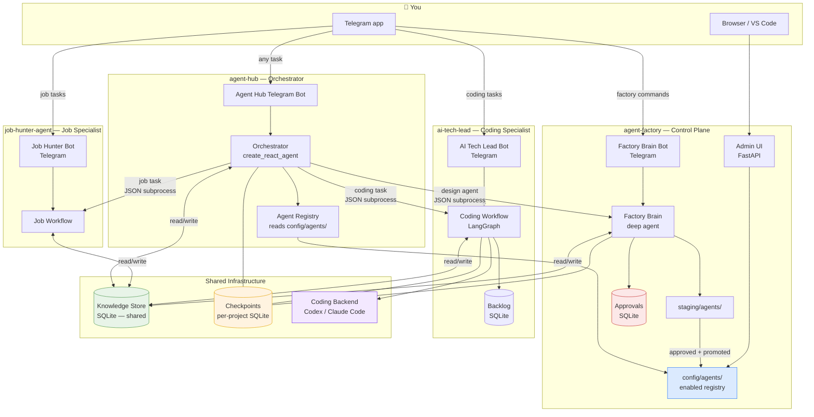

# System Overview — The Full Agent Platform

All components and how they connect. Every box is a real running process or data store.

## Key rules

- **Factory** designs and promotes agents. It never runs coding work itself.
- **Orchestrator** routes requests. It never performs the work itself.
- **Specialist agents** (ai-tech-lead, job-hunter) do the actual work. They exist independently of the hub.
- **Knowledge Store** is shared. One SQLite file, all agents read from and write to it.
- **Checkpoints** are per-project. Each agent's conversation history stays in its own file.
- Every agent can also be used directly via its own Telegram bot — the hub is an additional entry point, not a replacement.
