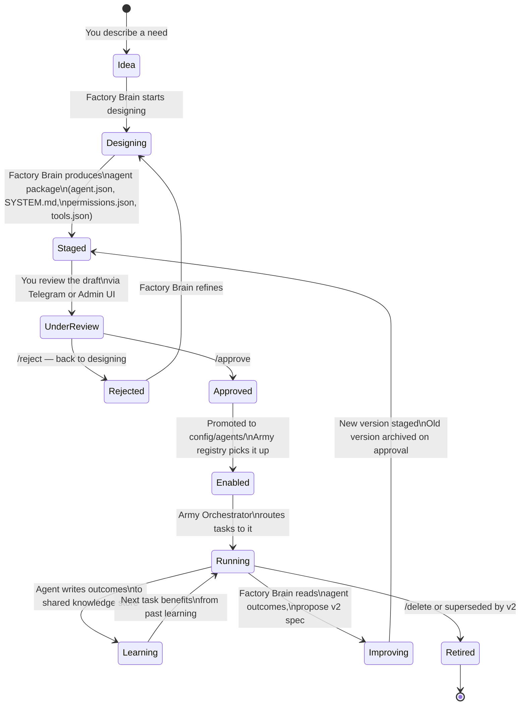

# Agent Lifecycle — From Idea to Army

How an agent goes from an idea to a running specialist in the army.

## What happens at each stage

| Stage | Who acts | Where it lives |
|---|---|---|
| Idea → Designing | You + Factory Brain | Conversation in Telegram |
| Staged | Factory Brain | `staging/agents/<id>/` |
| Under Review | You | Admin UI or Telegram `/staged` |
| Enabled | Factory (on `/approve`) | `config/agents/<id>/agent.json` |
| Running | Army Orchestrator | Live, called via subprocess |
| Learning | The agent itself | `knowledge_store.sqlite3` |
| Improving | Factory Brain (reads logs) | New staging draft |
