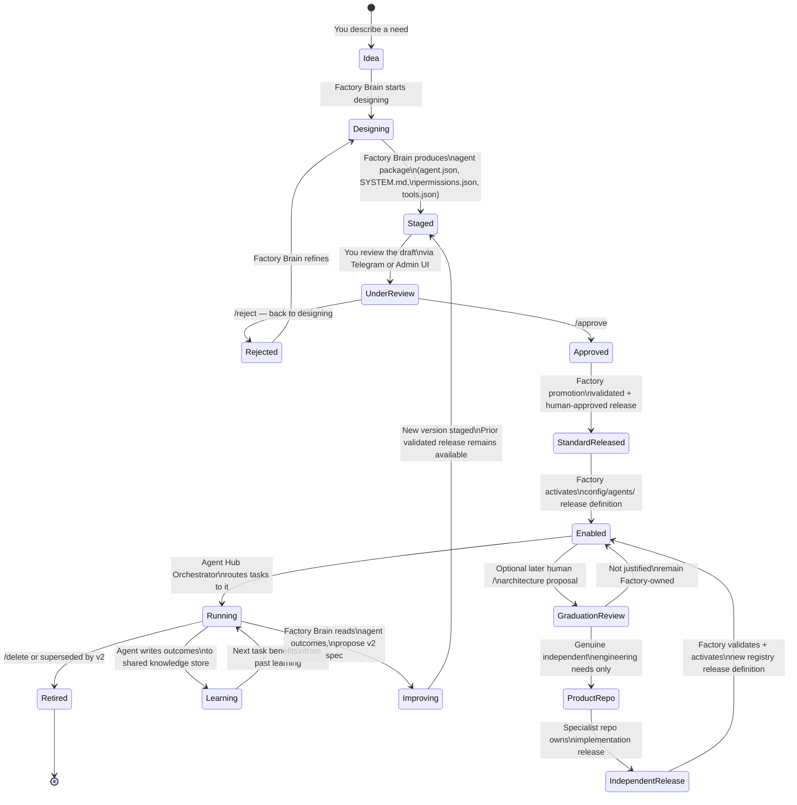

# Agent Lifecycle — From Idea to Released Agent

How an agent goes from an idea to a released specialist in the hub, including the
explicit boundary between a Factory-owned standard release and an independent product.

```mermaid
stateDiagram-v2
    [*] --> Idea : You describe a need

    Idea --> Designing : Factory Brain starts designing
    Designing --> Staged : Factory Brain produces\nagent package\n(agent.json, SYSTEM.md,\npermissions.json, tools.json)

    Staged --> UnderReview : You review the draft\nvia Telegram or Admin UI
    UnderReview --> Rejected : /reject — back to designing
    UnderReview --> Approved : /approve

    Rejected --> Designing : Factory Brain refines

    Approved --> StandardReleased : Factory promotion\nvalidated + human-approved release
    StandardReleased --> Enabled : Factory activates\nconfig/agents/ release definition

    Enabled --> Running : Agent Hub Orchestrator\nroutes tasks to it
    Enabled --> GraduationReview : Optional later human /\narchitecture proposal

    GraduationReview --> Enabled : Not justified\nremain Factory-owned
    GraduationReview --> ProductRepo : Genuine independent\nengineering needs only
    ProductRepo --> IndependentRelease : Specialist repo owns\nimplementation release
    IndependentRelease --> Enabled : Factory validates + activates\nnew registry release definition

    Running --> Learning : Agent writes outcomes\nto shared knowledge store

    Learning --> Running : Next task benefits\nfrom past learning

    Running --> Improving : Factory Brain reads\nagent outcomes,\npropose v2 spec

    Improving --> Staged : New version staged\nPrior validated release remains available

    Running --> Retired : /delete or superseded by v2

    Retired --> [*]
```

## What happens at each stage

| Stage | Who acts | Where it lives |
|---|---|---|
| Idea → Designing | You + Factory Brain | Conversation in Telegram |
| Staged | Factory Brain | `staging/agents/<id>/` |
| Under Review | You | Admin UI or Telegram `/staged` |
| Standard released | Factory (after validation, approval, and promotion) | Factory-owned package at `agents/<id>/` plus `config/agents/<id>.json` |
| Independent product | Specialist repository implements; Factory validates and activates | Specialist repository plus Factory-owned `config/agents/<id>.json` |
| Enabled | Agent Hub consumes the Factory-activated release definition | `config/agents/<id>.json` |
| Running | Agent Hub Orchestrator | Live, called via subprocess |
| Learning | The agent itself | `knowledge_store.sqlite3` |
| Improving | Factory Brain (reads logs) | New staging draft |

Promotion is release and enablement, not automatic graduation. Release rollback is
performed by activating a previously validated release/version through Factory release
governance, not by restoring arbitrary files or snapshots.
