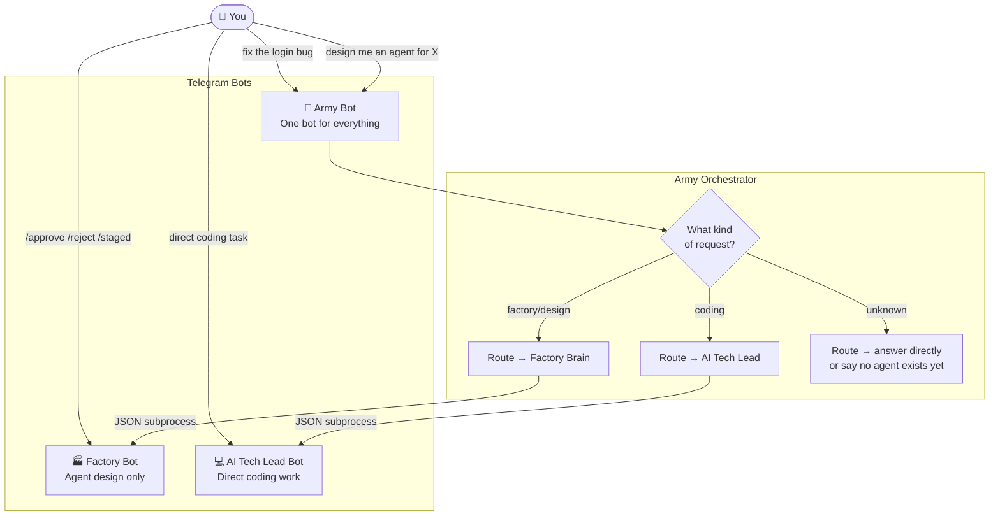

# Telegram Flows — Who Talks to Which Bot

You have multiple bots. Each has a distinct purpose. This diagram shows which one to use.

## Which bot to use when

| You want to... | Use |
|---|---|
| Do anything — let the system route it | Army Bot |
| Design, approve, or review agents | Factory Bot (or Army Bot — it will route) |
| Work directly on a coding task | AI Tech Lead Bot |
| Check platform status | Factory Bot `/status` |

## Commands

**Factory Bot**
- `/help` — all commands
- `/status` — platform status
- `/staged` — list agent drafts
- `/pending` — list pending approvals
- `/approve [id]` — approve or resume
- `/reject [id]` — reject or cancel
- `/new` — fresh session
- `/checkpoints` — list past states
- `/rollback <id>` — restore to past state
- `/fork <id>` — branch from past state
- `/delete <agent-id>` — remove an agent

**Army Bot** *(planned)*
- `/agents` — list all enabled agents
- `/new` — fresh conversation
- Natural language for everything else
