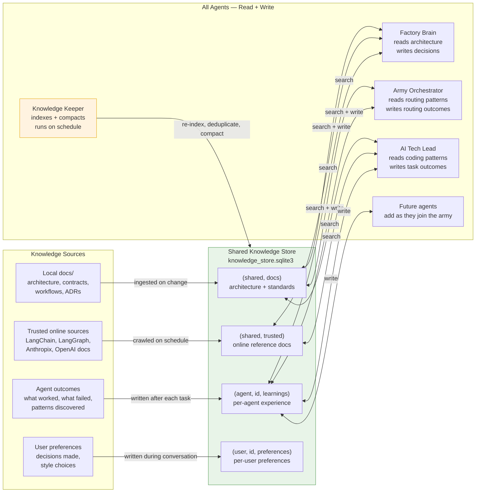

# Knowledge Flow — How Agents Learn and Share

All agents read from and write to one shared knowledge store. Knowledge compounds over time.

## How knowledge moves

1. **Indexing** — Knowledge Keeper reads `docs/` and trusted URLs, writes chunks to `(shared, docs)` and `(shared, trusted)` namespaces
2. **Retrieval** — Every agent calls `search_memory` and `search_trusted_sources` tools at the start of relevant tasks
3. **Writing** — Every agent calls `manage_memory` after decisions, task completions, and discoveries
4. **Compaction** — Knowledge Keeper runs periodic deduplication so the store doesn't grow forever

## What is NOT shared

- **Conversation checkpoints** — each agent's thread history stays in its own SQLite file
- **Backlogs** — each agent manages its own work queue
- **Secrets** — API keys, tokens — never touch the knowledge store
