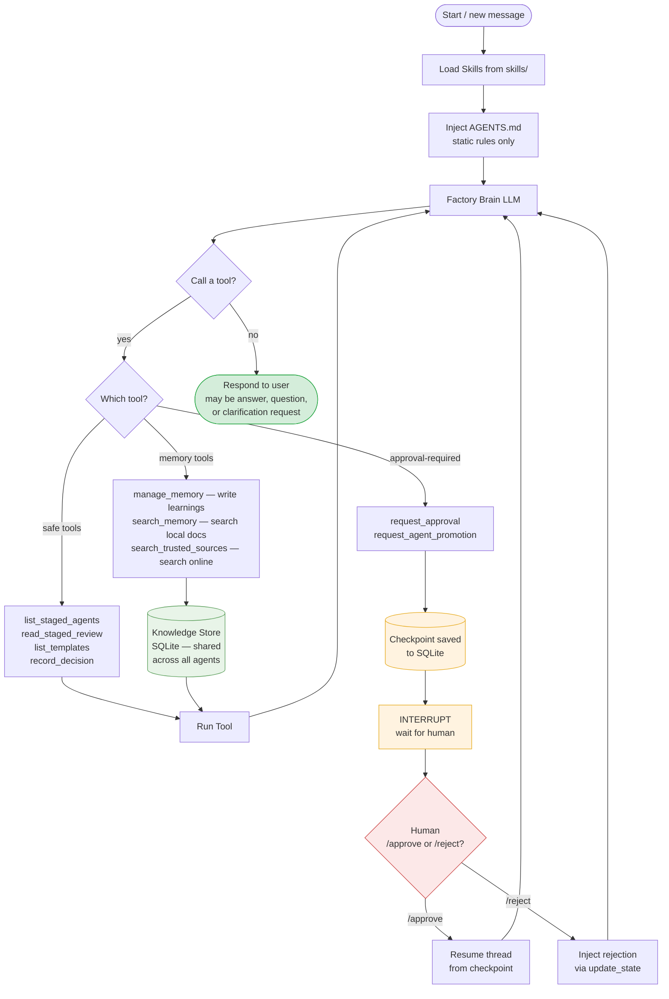

# Factory Brain Flow

Current as of 2026-06-15. This Markdown/Mermaid version is the current source view. The old standalone PNG preview has been moved to `diagrams/_review-old-pngs/` for review and is not part of the current canonical diagram set yet.

## What each layer does

| Layer | What | Token cost |
|---|---|---|
| Skills | Loaded on-demand per task type | Pay only when skill matches |
| AGENTS.md | Static rules, always injected | Fixed small cost per turn |
| Knowledge Store | Retrieved on-demand via search tools | Pay only for top-K relevant chunks |
| Checkpoints | Every turn saved to SQLite | Zero token cost — storage only |
| manage_memory | Writes learnings to store | One tool call per learning |

## Not yet implemented (in roadmap)

- `/checkpoints` — list past states for the current thread
- `/rollback <id>` — restore thread to a past checkpoint
- `/fork <id>` — branch a new thread from a past checkpoint
- Hot reload — code changes without restarting the gateway
- Semantic search — current store uses keyword matching, not embeddings
